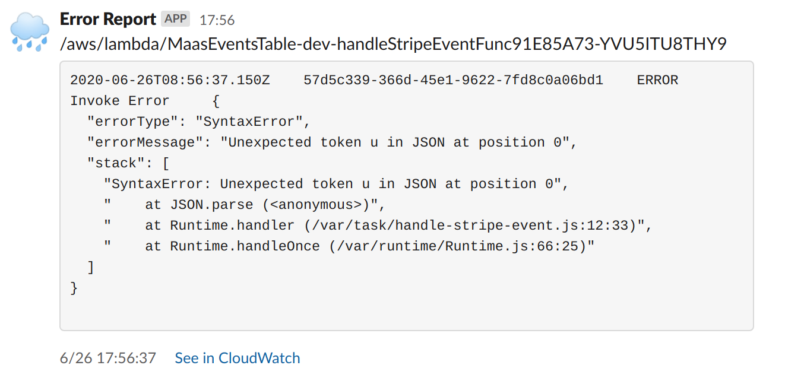

# cdk-log-notifier: Notify the logs which match a pattern via Slack.

The AWS CDK Construct to build a system that gather CloudWatch logs, filter and post to Slack.



## Example Usage

Watch the all logs contains "ERROR" from Lambda functions.

```typescript
const logNotifier = new LogNotifier(this, 'logNotifier', {
  filterPattern: logs.FilterPattern.allTerms('ERROR'),
  slackIncomingWebhookUrl: 'https://hooks.slack.com/...', // Use yours.
});

logNotifier.watch(lambdaFunc1.logGroup);
logNotifier.watch(lambdaFunc2.logGroup);
```

## Installation

```sh
npm i @thedesignium/cdk-log-notifier
```

## API Reference

### Class: `LogNotifier`

```typescript
new LogNotifier(scope: cdk.Construct, id: string, props: LogNotifierProps)
```

The properties in `props`:

- `filterPattern`: The [FilterPattern object in aws-cloudwatch module](https://docs.aws.amazon.com/cdk/api/latest/docs/@aws-cdk_aws-logs.FilterPattern.html). The logs is filtered as specified here. *Required.*
- `slackIncomingWebhookUrl`: The [Incoming Webhook URL](https://api.slack.com/messaging/webhooks) of Slack. Create for the Slack channel the logs should be posted. *Required.*

#### Static Method: `fromAttributes`

```typescript
LogNotifier.fromAttributes(scope: cdk.Construct, id: string, attrs: LogNotifierAttributes): LogNotifier
```

Instantiate from the attributes. Put the value of `logNotifier.attributes` as `attrs` parameter.

#### Method: `watch`

```typescript
logNotifier.watch(logGroup: logs.LogGroup): void
```

Add the log group to watch list to notify. The logs in the watched log groups are filtered by the filterPattern and posted to Slack.

#### Property: `attributes`

```typescript
attributes: LogNotifierAttributes
```

To use with `LogNotifier.fromAttributes()`.

## FAQ

### Cross Stack?

Possible. Export all values in `LogNotifier.prototype.attributes`, import it and use `LogNotifier.fromAttributes()` in another Stack.

### How can I customize the Slack bot icon or name?

You can set at [Slack App setting page](https://api.slack.com/apps), or Incoming Webhook configuration page if you use [Legacy Incoming Webhook](https://api.slack.com/legacy/custom-integrations/incoming-webhooks).
